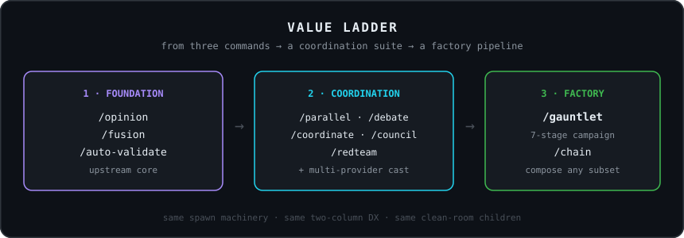
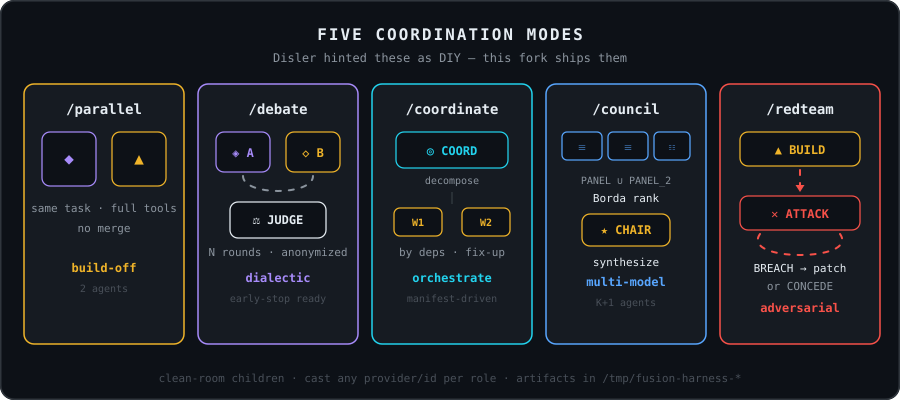
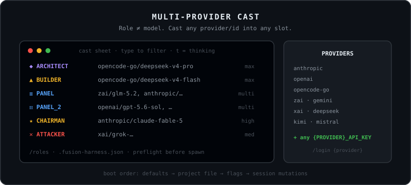
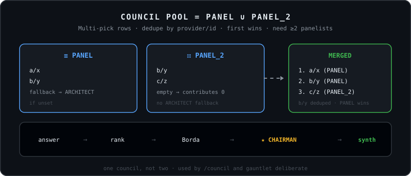
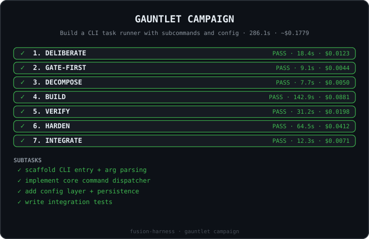

# fusion-harness

> **Fuse frontier models instead of racing them. AND, not OR.**
>
> A standalone [Pi coding agent](https://github.com/badlogic/pi-mono) extension for multi-model agentic engineering.

Fork of [disler/fusion-harness](https://github.com/disler/fusion-harness) — same fusion thesis, extended into a full coordination suite and campaign pipeline.

<p align="center">
  
</p>

<p align="center">
  
</p>

"Which model is best" is a benchmark question, not an engineering question. One model plans, another builds, and the results fuse: you combine compute instead of selecting it. Aider called the pattern [architect/editor](https://aider.chat/2024/09/26/architect.html); [Devin calls it fusion](https://cognition.com/blog/devin-fusion); [OpenRouter calls it model fusion](https://openrouter.ai/blog/announcements/fusion-beats-frontier/). **You don't have to pick a winner when you can hire both.**

This fork keeps the original three commands and ships what upstream only sketched: cast any provider into any role, five coordination modes, a council with `PANEL` ∪ `PANEL_2`, and `/gauntlet` — a full campaign pipeline you can also slice with `/chain`.

<p align="center">
  
</p>

---

## Install

**Prereqs:** [`pi`](https://github.com/badlogic/pi-mono), [`just`](https://github.com/casey/just), [`jq`](https://jqlang.github.io/jq/), [`uv`](https://docs.astral.sh/uv/).

```bash
npm install -g @earendil-works/pi-coding-agent
brew install just jq uv   # or: winget install Casey.Just jqlang.jq astral-sh.uv
printf 'OPENCODE_API_KEY=...\n' >> .env
just fh
```

Default cast (`just fh`) is DeepSeek via OpenCode Go at max thinking:

```bash
pi -e extensions/fusion-harness/fusion-harness.ts \
  --model opencode-go/deepseek-v4-flash \
  --architect opencode-go/deepseek-v4-pro \
  --builder opencode-go/deepseek-v4-flash \
  --architect-thinking max --builder-thinking max
```

---

## 1 · Foundation (upstream core)

<p align="center">
  
</p>

| Command | Agents | What happens |
|---|---|---|
| `/opinion <prompt>` | 2 | Both models answer independently (read-only). Side-by-side panel: latency, tokens, cost, full answers. |
| `/fusion "<prompt>" "<fusion-prompt>"` | 3 | ARCHITECT + BUILDER answer in parallel (full tools), then a FUSION agent merges both with `[ARCHITECT]`/`[BUILDER]` attribution. |
| `/auto-validate <prompt>` | 2 + gate | VALIDATOR designs a gate first, BUILDER builds, gate runs, failures loop until green or halt. |

### Raw chat IS the builder

<p align="center">
  
</p>

The host runs on the BUILDER model. Plain messages = native Pi. Slash commands fork the builder child, inheriting your raw chats. The ARCHITECT stays a separate persistent brain (per project + per model in `/tmp/fusion-harness-sessions/`).

### The auto-validation loop

<p align="center">
  
</p>

1. VALIDATOR designs `gate.py` first (Astral `uv` PEP 723 script)
2. Baseline must fail RED
3. BUILDER builds with full tools
4. Gate runs — FAIL lines feed back verbatim, PASS ends loop
5. From `--escalate-to-validator-count`-th failure, VALIDATOR triages
6. Gate repair if defect detected (once per run, no builder round consumed)
7. Halt after `--max-validations` failures

### Two columns, everywhere

<p align="center">
  
</p>

ARCHITECT left, BUILDER right. Live streaming widget, final panels in scrollback, aligned footer with role/model/thinking/context-bar.

Hard role glyphs: ◆ ARCHITECT, ▲ BUILDER, ⧉ FUSION, ✓ VALIDATOR, ◈ DEBATER_A, ◇ DEBATER_B, ⚖ JUDGE, ◎ COORDINATOR, ☰ PANEL, ☷ PANEL_2, ★ CHAIRMAN, ✕ ATTACKER.

### Clean-room children

Every spawn: `--no-skills --no-extensions --no-context-files`. Children never load your skills or context files. Only the HOST loads them.

---

## 2 · Coordination suite (this fork)

Upstream README said you *could* build `/debate`, `/parallel`, `/coordinate`. This fork ships those plus `/council` and `/redteam`.

<p align="center">
  
</p>

| Command | Agents | What happens |
|---|---|---|
| `/parallel <prompt>` | 2 | ARCHITECT and BUILDER execute the same task with full tools in parallel — a build-off. |
| `/debate <prompt> [--rounds N] [--reveal]` | 2–3 | Multi-round dialectic. Anonymized judge renders verdict on an anonymized transcript. Early-stop convergence check. |
| `/coordinate <prompt> [--no-fix-up]` | 1+ | Manifest-driven orchestration: COORDINATOR decomposes → workers execute by dependency level → COORDINATOR verifies + one fix-up pass. |
| `/council <prompt>` | K+1+ | Merged panel from `PANEL` ∪ `PANEL_2` answers independently, anonymized Borda ranking, CHAIRMAN synthesizes. |
| `/redteam <prompt> [--rounds N]` | 2 | Adversarial build/attack loop: BUILDER builds, ATTACKER probes, BREACH feeds back for patches, CONCEDE ends green. |

### Multi-provider cast

<p align="center">
  
</p>

Every role can hold any model from any registered provider. The cast sheet opens on invocation — type to filter, `t` to cycle thinking, `Esc` to cancel with zero side effects.

Supporting commands: `/roles` (cast sheet anytime), `/thinking <level> [builder-level]`, `/fh-reset`, `/system-prompt`.

Project cast file: `<cwd>/.fusion-harness.json` — roles → `{ model, thinking? }`. Boot order: built-in defaults → project file → flags → session mutations.

### Council: PANEL ∪ PANEL_2

<p align="center">
  
</p>

`PANEL` and `PANEL_2` are multi-pick rows (comma-separated models). `/council` and gauntlet deliberate merge them into one panelist pool: all `PANEL` models first, then new `PANEL_2` models, deduped by exact `provider/id` (first wins). Unset `PANEL` falls back to `ARCHITECT`; empty `PANEL_2` contributes zero models. Need ≥2 unique panelists after merge.

### Provider table

| Provider | Auth env var | `/login` command |
|---|---|---|
| `anthropic` | `ANTHROPIC_API_KEY` | `/login anthropic` |
| `openai` | `OPENAI_API_KEY` | `/login openai` |
| `zai` | `ZAI_API_KEY` | `/login zai` |
| `opencode` / `opencode-go` | `OPENCODE_API_KEY` | `/login opencode` |
| `gemini` / `google` | `GEMINI_API_KEY` | `/login gemini` |
| `xai` / `grok` | `XAI_API_KEY` | `/login xai` |
| `deepseek` | `DEEPSEEK_API_KEY` | `/login deepseek` |
| `kimi` / `moonshot` | `MOONSHOT_API_KEY` | `/login kimi` |
| `mistral` | `MISTRAL_API_KEY` | `/login mistral` |
| *(any)* | `{PROVIDER}_API_KEY` | `/login {provider}` |

---

## 3 · Factory pipeline (this fork)

<p align="center">
  
</p>

<p align="center">
  
</p>

| Command | Agents | What happens |
|---|---|---|
| `/gauntlet <prompt> [--skip-council] [--skip-redteam] [--deliberate=council\|debate] [--resume [dir]]` | 10+ | Full pipeline: deliberate → gate → decompose → build → verify → harden → integrate. |
| `/chain <stages> <prompt>` | varies | Run ordered stage subsets: `deliberate,gate,build,verify` etc. Prerequisite validation before any spawn. |

Stages compose the coordination modes you already have — council/debate for deliberate, auto-validate-style gates, coordinate-style decompose/build, redteam for harden. `/chain` is the same machinery without forcing the full campaign.

---

## Diagram MCP

Generate or regenerate the fork README SVGs with [`fusion-svg-mcp`](https://github.com/oteroantoniogom/fusion-svg-mcp) (also vendored at `tools/fusion-svg-mcp`):

```bash
cd tools/fusion-svg-mcp && npm install && npm run generate
```

---

## Recipes

```
just fh                 # default: opencode-go deepseek-v4-pro + deepseek-v4-flash (max thinking)
just fh-workhorse       # WORKHORSE tier (testing)
just fh-sota            # STATE-OF-THE-ART tier
just fh-glm             # zai/glm-5.2 + zai/glm-5-turbo
just fh ARCH=zai/glm-5.2 BUILDER=openai/gpt-5.6-sol
```

---

## Flags

| Flag | Default | Meaning |
|---|---|---|
| `--architect <provider/id>` | `opencode-go/deepseek-v4-pro` | Plans / fuses / validates |
| `--builder <provider/id>` | `opencode-go/deepseek-v4-flash` | Builds |
| `--architect-thinking <level>` | `max` | Thinking for all architect-family agents |
| `--builder-thinking <level>` | `max` | Thinking for all builder agents |
| `--architect-system-prompt <text\|path>` | pi default | System prompt for architect workers |
| `--builder-system-prompt <text\|path>` | pi default | System prompt for all builder agents |
| `--max-validations <n>` | `5` | Gate validations before halting |
| `--escalate-to-validator-count <n>` | `3` | Failure count before VALIDATOR triages |
| `--child-timeout <seconds>` | `28800` | Timeout for every spawned child (clamp 10–86400) |
| `--cast-defaults` | — | Skip cast sheet, use current session cast |

---

## Prompts

Every default prompt sits next to the extension with `{{VARIABLE}}` interpolation — tune the harness by editing files, not code.

| File | Used by |
|---|---|
| `SYSTEM_PROMPT_VALIDATOR.md` | Gate design |
| `SYSTEM_PROMPT_TRIAGE.md` | Escalation diagnosis |
| `USER_PROMPT_FUSION_WORKER.md` | /fusion ARCHITECT + BUILDER workers |
| `USER_PROMPT_FUSION_MERGE.md` | /fusion FUSION agent |
| `USER_PROMPT_FUSION_DEFAULT_INSTRUCTION.md` | Default merge instruction |
| `USER_PROMPT_OPINION.md` | /opinion both agents |
| `USER_PROMPT_BUILDER.md` · `USER_PROMPT_CORRECTION.md` | Auto-validate build + correction |
| `USER_PROMPT_VALIDATOR.md` · `USER_PROMPT_TRIAGE.md` | Gate design + triage |
| `USER_PROMPT_DEBATE_*.md` | /debate opening, rebuttal, judge, convergence |
| `USER_PROMPT_COORDINATOR*.md` | /coordinate decomposition, worker, integration |
| `USER_PROMPT_COUNCIL_*.md` | /council panelist, ranking, chairman |
| `USER_PROMPT_REDTEAM_*.md` | /redteam builder, attacker |

---

## Artifacts

Every run writes to `/tmp/fusion-harness-XXXXXX/` — `prompt.md`, role answers, `fused.md`, `gate.py` + `gate-output.txt`, `summary.json`. Nothing is written into the repo.

---

## Folder structure

```
fusion-harness/
├── extensions/fusion-harness/
│   ├── fusion-harness.ts        # the whole harness — commands, widget, footer, renderer
│   ├── SYSTEM_PROMPT_*.md       # validator + triage contracts
│   └── USER_PROMPT_*.md         # every default prompt, {{VAR}} interpolated
├── tests/                       # gauntlet + integration tests
├── images/                      # README visuals (Disler SVGs + fork diagrams)
├── justfile                     # task runner
├── .env                         # API keys (never commit)
└── LICENSE                      # MIT
```

---

## Known failure modes

- **`uv` missing or gate timeout**: halts `/auto-validate` immediately, never burns correction rounds
- **Weak gate**: baseline passes before work — harness warns loudly, treat as gate defect
- **`.env` vs exported vars**: `just` dotenv-load does NOT override exported shell vars
- **Parallel writers share cwd**: identity-in-filename required (`-ARCHITECT-<model>`)
- **Stale role memories**: `/fh-reset` gives both roles a clean brain
- **Headless hosts**: `--no-session` falls back to manifest-pinned persistent session

---

## Upstream

Built on [disler/fusion-harness](https://github.com/disler/fusion-harness) by [IndyDevDan](https://github.com/disler). Original video walkthrough: [GPT-5.6 Sol vs Fable 5 Is the Wrong Question (Fusion)](https://youtu.be/AQl5Q-0l7FQ).

---

## License

MIT — see [`LICENSE`](LICENSE).
