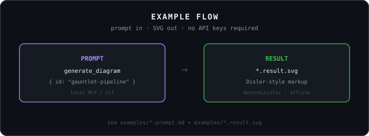
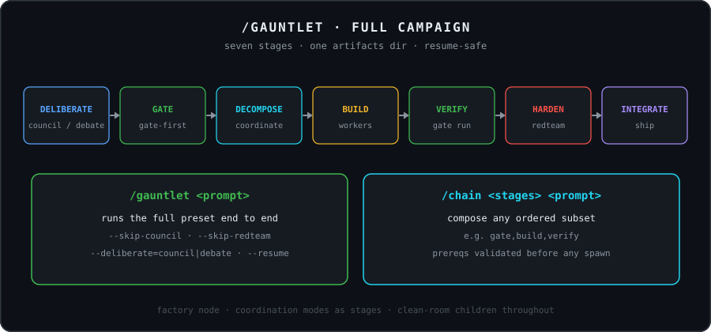

# fusion-svg-mcp

MCP server that generates **Disler-style** [fusion-harness](https://github.com/disler/fusion-harness) README diagrams — same dark GitHub chrome, monospace type, role colors, and CSS flow animations.

Used by the fork: [oteroantoniogom/fusion-models](https://github.com/oteroantoniogom/fusion-models).

## Install

```bash
git clone https://github.com/oteroantoniogom/fusion-svg-mcp.git
cd fusion-svg-mcp
npm install
```

### Cursor MCP (`~/.cursor/mcp.json`)

```json
{
  "mcpServers": {
    "fusion-svg": {
      "command": "npx",
      "args": ["tsx", "src/server.ts"],
      "cwd": "/ABSOLUTE/PATH/TO/fusion-svg-mcp"
    }
  }
}
```

On Windows, prefer an absolute `node.exe` + `tsx` path if `npx` is unreliable in MCP hosts.

## Tools

| Tool | Purpose |
|---|---|
| `list_style_tokens` | Palette, glyphs, structural rules from Disler originals |
| `list_diagrams` | Diagram ids (`svg-07`…`svg-12`) + reference originals |
| `preview_diagram` | Return SVG markup without writing |
| `generate_diagram` | Write one SVG to disk |
| `generate_all_fork_diagrams` | Write all fork diagrams |

## CLI

```bash
npm run generate
npm run generate -- gauntlet-pipeline
npm run generate -- --out ./out
```

## Diagrams

| Id | File |
|---|---|
| `gauntlet-campaign` | `svg-07-gauntlet-campaign.svg` |
| `coordination-suite` | `svg-08-coordination-suite.svg` |
| `multi-provider-cast` | `svg-09-multi-provider-cast.svg` |
| `council-panel` | `svg-10-council-panel.svg` |
| `value-ladder` | `svg-11-value-ladder.svg` |
| `gauntlet-pipeline` | `svg-12-gauntlet-pipeline.svg` |

Open `preview.html` to compare against upstream `svg-03`.

## Examples (prompt → result)

| Prompt | Result SVG |
|---|---|
| [`examples/gauntlet-pipeline.prompt.md`](./examples/gauntlet-pipeline.prompt.md) | [`examples/gauntlet-pipeline.result.svg`](./examples/gauntlet-pipeline.result.svg) |
| [`examples/coordination-suite.prompt.md`](./examples/coordination-suite.prompt.md) | [`examples/coordination-suite.result.svg`](./examples/coordination-suite.result.svg) |
| [`examples/council-panel.prompt.md`](./examples/council-panel.prompt.md) | [`examples/council-panel.result.svg`](./examples/council-panel.result.svg) |

Flow diagram: [`examples/prompt-to-result.result.svg`](./examples/prompt-to-result.result.svg)

```bash
npm run examples
```

<p align="center">
  
</p>

<p align="center">
  
</p>

## Style grammar (from Disler originals)

| Token | Rule |
|---|---|
| Canvas | `#0d1117`, `rx=14`, inset stroke `#30363d` |
| Cards | `#161b22`, `rx=10`, accent stroke `1.5` |
| Roles | architect `#a78bfa` · builder `#f0b429` · fusion `#22d3ee` · success `#3fb950` · error `#f85149` · panel `#58a6ff` |
| Font | `ui-monospace,SFMono-Regular,Menlo,Consolas,monospace` |
| Motion | `.flow` dash march `1.1s` + `prefers-reduced-motion: reduce` |

## License

MIT
